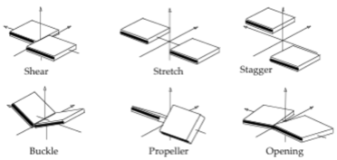

# DNAflexsuite

DNAflexsuite is a suite of tools to predict DNA flexibility from sequence at different resolutions.
The three tools included in DNAflexsuite are base on different models of DNA flexibility:

1. the Rigid Base-Pair model (RBP);
2. the Stiffening Spring Model (SSM);
3. the Rigid Base model (RB).

These three models are parameterised starting from similar data, namely long-timescale Molecular Dynamics simulations of naked B-form DNA oligomers.
Nevertheless the tools provide three different views on DNA flexibility.  From a practical point of view, the differences lie in their definition of flexibility and their accuracy and speed of execution.

# The Rigid Base-Pair Model
The flexibility of a B-form DNA oligomer is predicted in the form of a stiffness matrix as a function of the well-known and widely used inter base-pair Curves+ helical parameters of DNA (Lavery 2009) (see Figure 1).

**Figure 1: Inter-base pair parameters; slabs represent adjacent base pairs. Image courtesy of Curves+.**

These represent a set of independent coordinates, 6 for each base-pair step, as a function of which covariances are calculated on long-timescale atomistic MD simulations (Hospital 2013) in order to parameterise the RBP model. Entries of the oligomer-level covariance matrices referring to a single base-pair step (corresponding to 6x6 diagonal blocks) are taken to be  sequence-dependent at the tetranucleotide level, and their inverses are used to build block-diagonal oligomer-level stiffness matrices for arbitary-sequence oligomers. For an $n$-bp DNA oligomer, the RBP tool predicts a block-diagonal $NxN$ stiffness matrix, where $N=6(n-3)$ corresponds to the number of helical coordinates for the given oligomer (one per base-pair step), excluding terminal base-pairs. The RBP tool makes predictions very efficiently, even for several hundreds of kilobasepairs, which can be used as very approximate stiffness matrices, or analysed in order to obtain information on the rigidity of the helical coordinates, and their local coupling.

# The Stiffening Spring Model
Predicts the flexibility of a canonical B-form DNA oligomer of arbitrary sequence in the form of a vector of tetranucleotide variances in Cartesian space. SSM predictions are based on atomistic MD-derived, Cartesian coordinate tetranucleotide variances, but take into account the stiffening effect of conformational frustration between overlapping tetranucleotides. A nearest-neighbour approximation of this perturbation makes SSM prediction effectively hexanucleotide-dependent. The SSM is extremely fast, so that the flexibility of millions of base pairs can be predicted quickly using information from atomistic simulations, and used for example as a physics-based track in genome annotation. For more information see (Pasi 2016). 

# The Rigid Base Model
Flexibility of B-form DNA is described in a similar way to the RBP model, but in this case the coordinates used to describe DNA also include the Curves+ intra base-pair helical parameters of DNA (Lavery 2009) (see Figure 2).

**Figure 2: Intra-base pair parameters; slabs represent paired bases. Image courtesy of Curves+.**

This finer discretisation of the conformational space of DNA results in improved accuracy and provides a more detailed picture of DNA flexibility. The cgDNA model is unique among existing coarse-grain models of DNA in that it predicts ground states with a nonlocal sequence dependence, despite its parameter set having at most dinucleotide dependence. In this respect, cgDNA provides a natural model for the frustration of pre-existing stress in a molecule, in analogy to the SSM (Gonzalez 2013). For an $n$-bp DNA oligomer, the RB tool predicts a $NxN$ stiffness matrix, where $N=12n-6$ corresponds to 6 intra-base-pair coordinates for each base pair, and 6 inter-base-pair coordinates for each base pair step. It is worth noting that stiffness matrices predicted using the RB tool are not block diagonal, but decay slowly away from the diagonal, which makes them better suited for being used e.g. to predict elastic free energy differences (Petkeviciute 2014). 

# References
[Lavery 2009] Lavery,R., Moakher,M., Maddocks,J.H., Petkeviciute,D.  and Zakrzewska,K. (2009) Conformational analysis of nucleic acids revisited: Curves+. *Nucleic Acids Res.*, 37, 5917-5929.
[Hospital 2013] Hospital,A., Faustino,I., Collepardo-Guevara,R., Gonzalez,C., Gelpi,J.L. and Orozco,M. (2013) NAFlex: a web server for the study of nucleic acid flexibility. *Nucleic Acids Res.*, 41, W47-W55.
[Pasi 2016] Pasi,M., Triantafyliou,S., Shkurti,A. and Laughton,C.A. (2016) *in preparation*
[Gonzalez 2013] Gonzalez,O., Petkeviciute,D.  and Maddocks,J.H.  (2013) A sequence-dependent rigid-base model of DNA. *J Chem Phys*, 138, 055102.
[Petkeviciute 2014] Petkeviciute,D., Pasi,M., Gonzalez,O., and Maddocks,J.H. (2014) cgDNA: a software package for the prediction of sequence-dependent coarse-grain free energies of B-form DNA. *Nucleic Acids Res.*, 42, e153-
